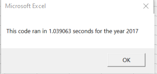
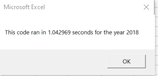

# An Analysis of Green Stocks
## Overview
Steve is a recent graduate with a Finance degree who is researching green energy stocks.
His parents would like to invest in a new energy company (DAQO).
Steve wants to compare performance of green energy stocks and DAQO by analyzing financial data using VBA.
## Results
### Prior Analysis
In our prior analysis, we created a subroutine that showed us the yearly volume for 2018, indicating DAQO dropped 63% in 2018.
These results encouraged us to analyze a whole list of stocks by adding to our subroutine.  We also wanted to create a macro that could be used with different stocks in the future.  Instead of reusing our code, we expanded our subroutine:
* We created and formatted an analysis worksheet. 
* For our array, we assigned each ticker as an element.
* We initialized varaibles for prices using `Dim` statements.
* We looped through the tickers, resetting total volume to zero for each (in the outside ticker loop).
* We looped through the rows of data using nested `for` loops to find the total volume, starting and ending prices for the each ticker.
* We created an output row for each ticker.  

After running the analysis, we formatted the results using VBA static and conditional formatting, for easier reading.
Next, we created a button to click to run the macro as well as a macro to clear the worksheet.
Last, we created an input box for year selection and a timer function to see how long it takes to run the script.
### Refactoring Code
Steve loved our previous work and wants to expand the dataset.  In this challenge, we were to edit existing code to loop thorugh all data one time, making the code more efficient.
Using our file with a new script to be refactored,
* We created a tickerIndex and initialized three output arrays.
* We created a `for` loop to initialize tickerVolumes to zero and another `for` loop to loop over all the rows.
* We wrote `If-then` statements to assign starting and end prices and to increase the tickerIndex.
* We used a `for` loop to loop through the arrays to output ther results.
### Comparisons
We ran the refactored 2017 and 2018 stock analysis, confirming the outputs were the same as our previous analysis.  We also saved and included the pop-up messages with the timer messages as shown below.

## Summary
The advantages include having well structured code that helps to find logical errors as well as reveal patterns more easily.
The disadvantages include having to consolidate duplicate lines (from the original code) that may be in several places, tracing the steps in a more consolidated manner is more complex and of course, the refactored outcomes may differ, prompting you to review/redo.

The disadvantages result in an overall advantage.  Code that is well-organized and structurally sound, including comments, will be easier to maintain and edit as needed in the future, whether by the author or someone else.
